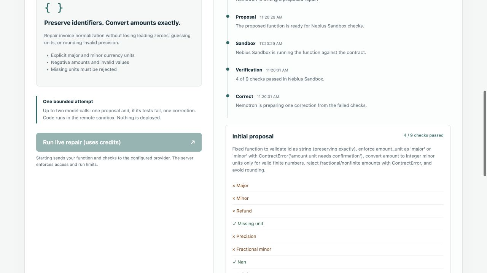

# API Repair Bench

## Judges — start here

- **Live:** [repairbench.deltaxevaluate.com/live](https://repairbench.deltaxevaluate.com/live/)
- **Replay if live allowance is used:** [saved review](https://repairbench.deltaxevaluate.com/)
- **One sentence:** Nemotron proposes a patch, Nebius Sandbox runs your checks, one correction max, then it stops.



**90-second judging cut:** [watch the live repair walkthrough](https://youtu.be/MYQMYI5FR2I)

Click **Run a repair → Invoice repair → Run live repair**. Watch the trace move through NVIDIA Nemotron, Nebius Token Factory and Nebius Sandbox; then inspect the failed check, the one correction and the downloadable evidence. The exact click path is also in [JUDGES.md](JUDGES.md).

## What this is

API Repair Bench is a review desk for a broken API client function when HTTP succeeded and the contract didn’t. It turns a proposed code change into bounded, inspectable evidence instead of silently deploying a guess.

Built for the Nebius × NVIDIA Global AI Hackathon, Coding and Agentic Engineering track. Original synthetic application and fixtures, developed with AI assistance under founder review. This repository does not include the private DeltaX engine.

## Reproduce locally — no account or key required

Python 3.12 is recommended. From this directory:

```sh
python3 cli.py demo
```

Open http://127.0.0.1:18767. This is a **recorded evidence replay**, not a fresh inference session. It presents the fictional reference demonstrations and separately labelled real NVIDIA/Nebius attempt results. Opening it makes no provider call and incurs no provider charge. The server exposes only bundled public assets.

Choose an integration, compare the source and reference repair, inspect the checks and recorded AI attempts, and export a reviewed reference example. Model proposals remain inert text in the browser. Keyboard controls and responsive layouts are included.

## Live workspace — public verification complete

The default public page remains the recorded review. The new `/live` workspace adds an explicit run button, progress trace, generated source, check outcomes and downloadable evidence. A visitor can select the fictional data-conversion example or supply one Python function with one to eight JSON checks. Jobs have a bounded proposal → Sandbox test → optional single correction → final result workflow. A missing or uncertain provider response is retained as unresolved, not automatically retried.

The public route has now completed a real browser-triggered run: the initial Invoice repair proposal passed 4/9 checks, the bounded correction passed 9/9, and the workflow stopped without deployment. That result is one observed run, not a reliability guarantee; historical recorded outcomes below remain separate.

The live workspace also includes a pagination case built around a real incident pattern: an HTTP 200 response dropped page 2. It checks empty pages, duplicate occurrences, repeated cursors and the request budget. See the concrete [incident card](docs/incident.md).

There are two adapters for the same product workflow:

- `live_service.py` and `custom_cases.py` provide the local Python implementation, durable SQLite jobs, visitor isolation and bounded worker execution.
- `portable-live/` provides a JavaScript core and the exact Nebius REST transport for an existing Sites Cloudflare Worker. Sites supplies the thin web/API layer; NVIDIA Nemotron inference and Python candidate execution remain on Nebius Token Factory and Nebius Sandbox. No GPU or additional application server is rented by this design.

The hosted Worker entrypoint and durable storage schema are included in deployment/. The portable-live modules remain the portable core and REST transport, so the candidate function still runs remotely in Nebius Sandbox rather than inside the website Worker. The deployment template takes NEBIUS_API_KEY and NEBIUS_PROJECT_ID from the host environment; no account-specific values are committed.

To inspect the local live UI with execution disabled:

```sh
python3 live_service.py --origin http://127.0.0.1:18768
```

Open http://127.0.0.1:18768/live. To enable your own provider-backed development run, configure `NEBIUS_API_KEY` privately and `REPAIR_BENCH_PROJECT_ID`, use the installed Sandbox dependencies, and explicitly add `--enabled`. Never put a key in source or browser code. The default limits allow three total jobs and two per visitor; the existing durable model-attempt allowance still applies. Read-only inspection must not reset job state, consumed budget or uncertain dispatches.

## Reproduce the offline checks

```sh
python3 -m unittest discover -v
node ui/test-ui.cjs
node live-ui/test-live.cjs
node --test portable-live/test-repair-core.mjs portable-live/sandbox-rest.test.mjs
python3 cli.py results
python3 cli.py challenge auth
```

Most Python checks use only the standard library. Two SDK-constructor checks skip until the optional Sandbox dependencies are installed; those checks forbid network access. Node is only needed for interface interaction tests. Tests do not run model-generated code locally.

`fixtures/` contains frozen model-visible challenge payloads and evaluator-only decision labels. Tests compare the current generators with those snapshots. `demo/` contains the curated recorded result export, including failed and unknown attempts. A historical result may use an earlier contract version: contract hashes distinguish it from a new experiment. Reference demonstrations are not model benchmark results.

## Run your own NVIDIA/Nebius experiment

You need your own Nebius Token Factory API key, model access and credit. Sandbox verification additionally requires active Sandbox access and your project ID. Keep your key private; the CLI requests it through a hidden terminal prompt and does not save it.

Install the reviewed SDK into a Python 3.12 virtual environment:

```sh
python3.12 -m venv .venv
.venv/bin/python -m pip install -r requirements-sandbox.txt
export REPAIR_BENCH_PROJECT_ID='your-own-project-id'
.venv/bin/python cli.py run auth --verify --allow-paid
```

The dependency is pinned to the reviewed SDK Git revision; a same-version PyPI wheel had incompatible constructor/retry behavior. Git must be available for installation. No account identifier or key is included in this repository.

`--allow-paid` explicitly opts into a provider action. A new model attempt reserves $0.01 against this installation's fixed $0.25 application allowance before dispatch. The reservation is a conservative local control, **not a billed price, provider-enforced cap, or account-wide spending limit**. The model request and Sandbox usage can have provider charges. Price estimates are a recorded September 2026 configuration and may change; check your provider account before running.

Local receipts and the durable ledger are stored under ignored `output/`. Never delete or replace them to retry uncertain effects or regain the allowance. This public installation's ledger is separate from the original experiment, which is not distributed here. No API request automatically retries.

To generate without Sandbox execution:

```sh
.venv/bin/python cli.py run pagination --allow-paid
```

To verify a previously generated, untested valid proposal, copy the returned run ID:

```sh
.venv/bin/python cli.py verify YOUR_RUN_ID --allow-paid
```

One correction can be requested after a completed failed baseline on the same contract:

```sh
.venv/bin/python cli.py correct YOUR_RUN_ID --allow-paid
```

That command only requests the correction; verification is a separate explicit command. Missing-unit and explicit-unit decision controls can be generated with `run decision-missing_unit` or `run decision-explicit_major_unit`; their decision quality is assessed by `ambiguity_cases.score_decision`, and their patches are not executed by the current CLI. `--verify` skips these decision controls.

## Architecture and limitations

- `challenges.py` supplies broken functions and complete public interfaces without reference answers. `inference_request.py` prepares the NVIDIA `nvidia/Nemotron-3_5-Lightning` request to Nebius Token Factory.
- `provider_client.py` verifies model availability, reserves before a single send, accepts only complete structurally valid proposals, and saves outcomes. `budget_guard.py` prevents duplicate reservations.
- `sandbox_bundle.py` packages only synthetic candidate, runner and job input. `sandbox_client.py` runs them remotely in Nebius Sandbox with bounded requested runtime/output. Expected results remain outside the candidate runtime.
- `custom_cases.py` validates a single function and user-supplied JSON checks without executing the source. `live_service.py` exposes the bounded visitor/job API.
- `pipeline.py` connects saved proposals, remote comparison and one feedback correction. `evaluation.py` separates paired corrections, changed contracts, rejections and uncertain outcomes.
- `serve.py` is the developer review desk for locally generated receipts; `cli.py demo` serves the bundled recorded judging replay.

Matching remote observations **does not prove trusted execution**: candidate code shares a process with the observation runner and can spoof output. Receipts retain `trusted_execution_proven: false`. Neither this synthetic suite nor the SDK settings establish production isolation, egress control, deletion, broad repair reliability or suitability for customer code. The recorded evaluation uses original fictional data. The live custom-function path accepts user-supplied code and checks; those examples do not prove general correctness. Generated changes are never deployed automatically.

## Recorded outcomes

See the replay and `demo/evidence.json` for the frozen aggregate, and `demo/recorded-data.js` for curated per-attempt checks and contracts.

| Experiment | Baseline | Correction | Observed outcome |
|---|---:|---:|---|
| Authentication, original contract | 4/6 | 4/6 | No recovery |
| Authentication, clarified response interface | 6/6 | Not attempted | Separate successful baseline; contract changed |
| Data conversion, initial feedback | 4/9 | 4/9 | No recovery |
| Data conversion, runtime exception diagnostics | 4/9 | 9/9 | Same-contract correction recovered five checks; zero check regressions |

The final data-conversion result is one successful paired correction among three evaluated pairs. Both amount-unit decision controls matched their expected decisions; those are decision checks, not patch-runtime checks. Pagination did not yield a valid patch. All 16 model attempts remain represented: 14 returned responses and two uncertain timeouts. These small synthetic results do not establish general repair reliability.

## License and attribution

Original application code and synthetic assets: MIT, see LICENSE. Dependencies and NVIDIA model/API access retain their own licenses and service terms; see THIRD-PARTY.md. Model weights and third-party SDK implementations are not distributed here.
